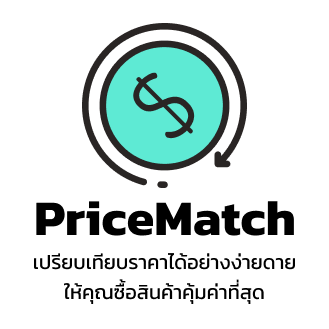

  

# PriceMatch เทียบราคา

PriceMatch is a React application that allows users to compare prices between products. The application supports both basic and advanced modes, and includes integration with Google Tag Manager (GTM) for event tracking.

## Features

- **Price Comparison**: Easily compare prices between two products.
- **Mode Toggle**: Switch between basic and advanced modes for more detailed comparisons.
- **Reset Functionality**: Reset all inputs with a single click.
- **Google Tag Manager (GTM) Integration**: Track user interactions using GTM.
